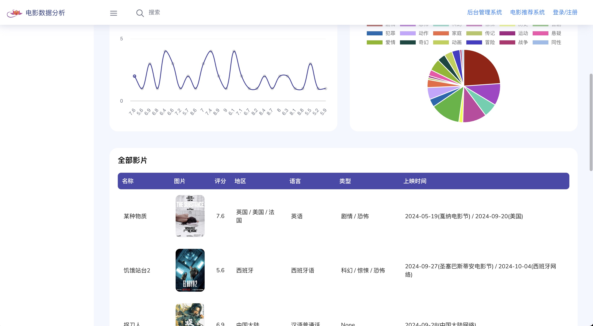
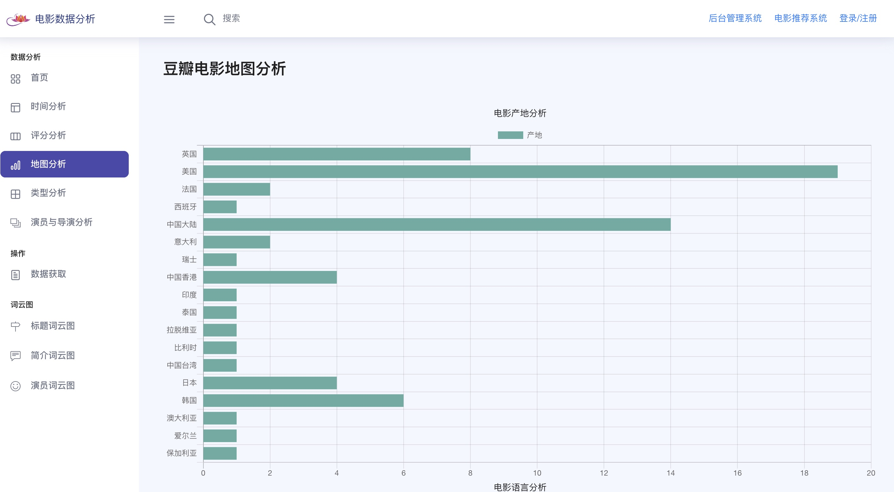

# 基于Python+Django的电影分析系统 + 电影推荐系统
基于Python+Django的电影分析系统 + 电影推荐系统
采用Bs4爬取豆瓣网的热门电影数据, 以多角度对数据进行分析并且使用echarts进行可视化展示
源码获取请见最下方联系方式
## 网页效果展示
### 首页

### 登录

### 注册

### 数据分析
    
## 电影推荐页面
 
### 源码获取
##### + xushien456 务必备注来意 或点击下方链接
https://www.yuque.com/wechatname-3aout/zr1vau/lvduggftsnqnczy0?singleDoc#
